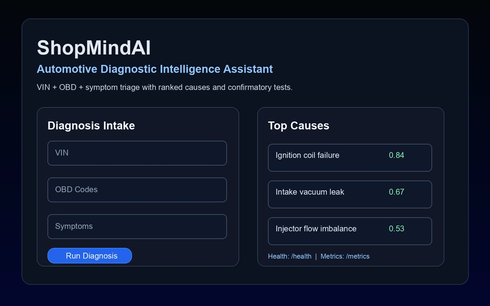
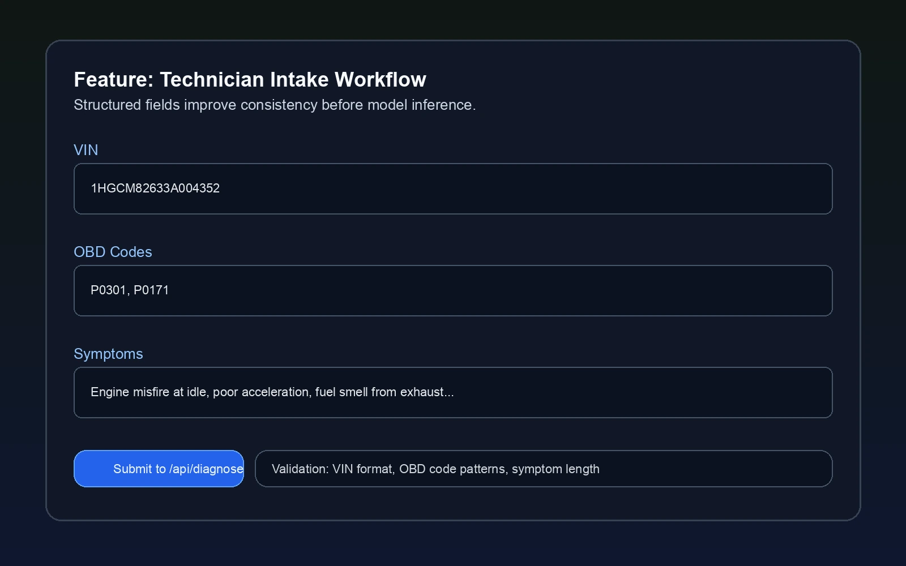
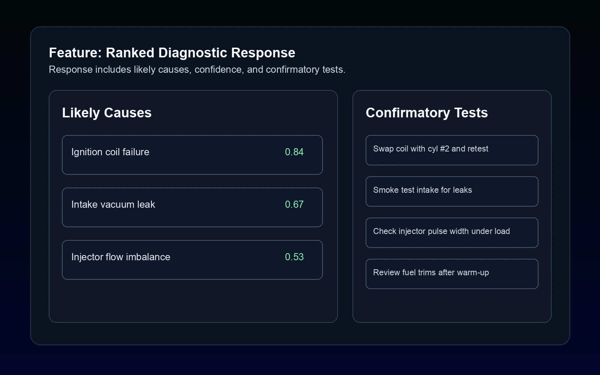

# ShopMindAI

ShopMindAI is an automotive diagnostic assistant that combines structured repair context, VIN-aware validation, and LLM reasoning to generate ranked repair guidance for technicians and small shops.

## Screenshots





## Value Proposition

- Converts unstructured symptom notes into ranked, actionable diagnostic paths.
- Reduces wasted troubleshooting time with likely causes and confirmatory tests.
- Exposes health/metrics endpoints for production monitoring and reliability checks.

## Architecture Snapshot

- FastAPI backend with typed schemas and modular service layer.
- `/api/diagnose` endpoint for diagnosis workflow.
- `/health` and `/metrics` endpoints for uptime/observability.
- Static web UI served from `app/static`.
- SQLAlchemy persistence and retrieval/ranking utilities.

Detailed docs:
- [Architecture](docs/architecture.md)
- [Setup](docs/setup.md)
- [Impact](docs/impact.md)

## Quickstart

```bash
python -m venv .venv
source .venv/bin/activate
pip install -r requirements.txt
cp .env.example .env
# fill required vars in .env
uvicorn app.main:app --host 0.0.0.0 --port 8000 --reload
```

Open `http://localhost:8000` and test:

```bash
curl -s http://localhost:8000/health
```

## Deployment (Azure)

Production target: `https://shopmind-ai.azurewebsites.net`.

Recommended Azure App Service startup command:

```bash
uvicorn app.main:app --host 0.0.0.0 --port 8000
```

Set secrets as app settings (do not commit secrets):
- `DEFAULT_PROVIDER`
- `GCP_MODEL_URL` or (`SILICONEFLOW_API_KEY` + `SILICONEFLOW_URL`)
- `DATABASE_URL`
- `ALLOWED_ORIGINS`

## API

- `POST /api/diagnose` - submit VIN, OBD codes, and symptoms for ranked recommendations.
- `GET /health` - service health.
- `GET /metrics` - Prometheus metrics output.

## Impact

- Designed for faster first-pass diagnostics and clearer technician decision support.
- Built for production readiness with typed contracts, error handling, rate limiting, and observability.

## Contact

- Email: `fuaadabdullah@gmail.com`
- LinkedIn: `https://www.linkedin.com/in/fuaadabdullah`
